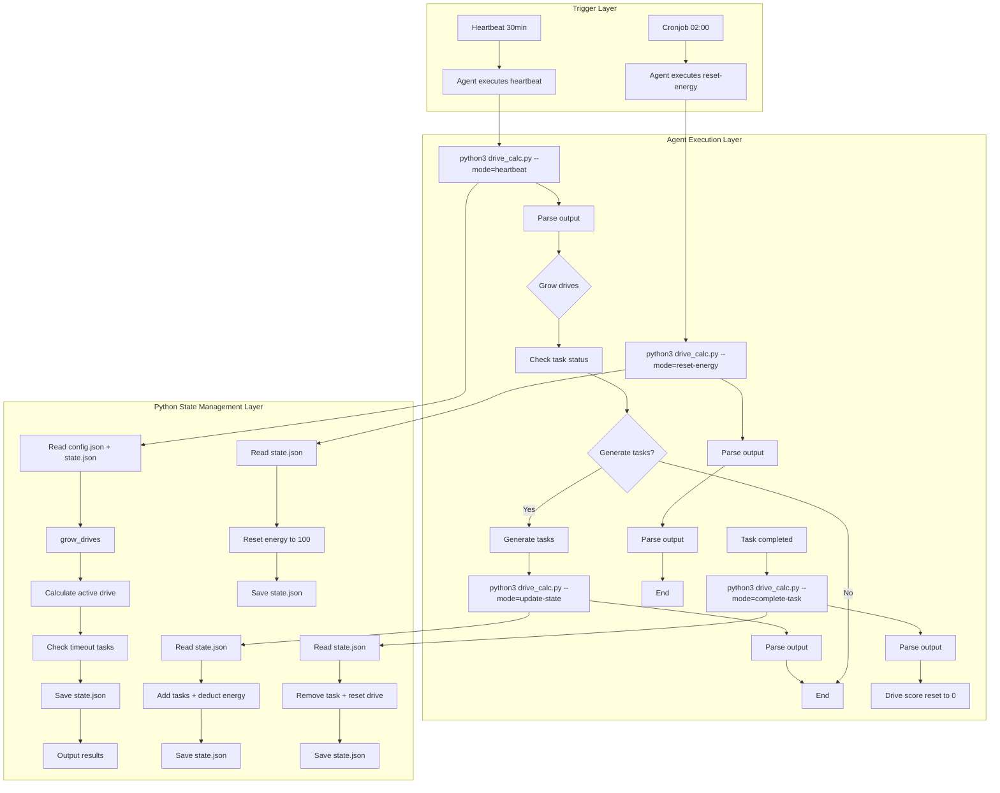

# AI Agent Drive Engine

An agent Skill that provides AI Agents with an internal motivation system. The Drive Engine generates self-driven task proposals based on internal "Drives".

## Overview

The Drive Engine is a motivation system for AI Agents that:

- Generates self-driven task proposals based on internal "Drives"
- Only proposes tasks, does not execute them (execution handled by other Agent skills)
- Is generic and does not depend on specific tools, knowledge bases, or workflows
- Supports flexible extension

## Core Concepts

| Concept | Definition |
|---------|------------|
| Drive | Agent's internal motivation dimension (e.g., curiosity, completion, optimization). Score ranges [0,1] and grows dynamically based on time/scenarios. |
| Active Drive | The drive with the highest score (or priority) in each heartbeat cycle, determining the core direction of task proposals |
| Heartbeat | Agent's lifecycle timer, triggers Drive Engine operations at fixed intervals (default: 30 minutes, configurable) |
| Energy System | Resource mechanism that limits task generation count. Energy resets daily at fixed time (default: 2:00 AM) |
| User Intervention | Toggle controlling whether tasks require human confirmation before execution |
| Growth Factor | Factor controlling how fast drive scores increase per heartbeat (default: 0.1) |

## Architecture



## File Structure

```
drive_engine/
├── config.json      # Static configuration (read-only)
├── state.json       # Dynamic state (managed by Python)
├── drives.md        # Drive definitions (read-only)
├── skill.md         # Agent operation guide
└── drive_calc.py    # State management script (core)
```

## Python Script Modes

### Heartbeat Mode
```bash
python3 drive_calc.py --mode=heartbeat
```
Calculates active drive and available task count. Output includes explicit instructions for the Agent.

### Reset Energy Mode
```bash
python3 drive_calc.py --mode=reset-energy
```
Resets energy to 100 and updates last_reset timestamp.

### Update State Mode
```bash
python3 drive_calc.py --mode=update-state --tasks "task1|30|10,task2|60|20" --energy-spent 30
```
Updates state.json with new tasks and deducts energy. Format: `taskID|plannedMinutes|energyCost`

### Complete Task Mode
```bash
python3 drive_calc.py --mode=complete-task --task-id=task_001
```
Marks task as complete and resets corresponding drive score to 0.

## Output Format

The Python script outputs structured instructions for the Agent:

```
ACTION: heartbeat
DRIVE: completion
ENERGY_REMAINING: 70
TASK_COUNT: 2
ENERGY_PER_TASK: 10
MAX_ENERGY_CONSUMPTION: 20
EXECUTING_TASKS: 2/2
GROWTH_FACTOR: 0.1
DRIVE_GROWTH: [curiosity: 0.50 -> 0.60, completion: 0.80 -> 0.90]
TASK_DETAILS:
  - task_001: 25min / 30min (OK)
  - task_002: 65min / 60min (WARNING: exceeded by 5min)
STALE_TASKS: [task_002]
INSTRUCTIONS: Based on completion drive, generate 2 small tasks. Format: --tasks "taskID|plannedMinutes|energyCost,..."
ACTION_REQUIRED: 1 task(s) exceeded planned duration. Please verify status.
```

## Configuration

### config.json
```json
{
  "heartbeat": {
    "interval_minutes": 30
  },
  "energy": {
    "max_energy": 100,
    "cost_per_task": 10,
    "daily_reset_time": "02:00:00"
  },
  "drives": {
    "list": ["curiosity", "completion", "optimization"],
    "priority": ["completion", "curiosity", "optimization"],
    "growth_factor": 0.1
  },
  "task": {
    "max_count": 3,
    "max_executing": 2,
    "default_duration_minutes": 60,
    "default_energy_cost": 10
  },
  "user_intervention": {
    "default_enabled": false
  }
}
```

### state.json
```json
{
  "drive_scores": {
    "curiosity": 0.5,
    "completion": 0.8,
    "optimization": 0.3
  },
  "energy": {
    "remaining": 70,
    "last_reset": "2026-03-10 02:00:00"
  },
  "last_heartbeat": "2026-03-10 14:30:00",
  "unfinished_tasks": ["task_001"],
  "executing_tasks": {
    "task_001": {
      "started_at": "2026-03-10 14:30:00",
      "planned_minutes": 30,
      "energy_cost": 10
    }
  },
  "user_intervention": {
    "enabled": false,
    "pending_tasks": []
  }
}
```

## Deployment

### 1. File Setup

Create drive_engine directory with the following files:
- `config.json` - Static configuration
- `state.json` - Dynamic state (initial values)
- `drives.md` - Drive definitions
- `skill.md` - Agent operation guide

### 2. Trigger Configuration

#### Heartbeat (30-minute intervals)
The heartbeat system triggers every 30 minutes. When triggered, the Agent should execute:

```bash
python3 drive_calc.py --mode=heartbeat
```

This is handled by the heartbeat system, not cronjob.

#### Cronjob (Daily at 02:00)
Configure a cronjob to trigger the Agent to execute energy reset:

```bash
# Edit crontab
crontab -e

# Add this line for daily energy reset at 02:00
0 2 * * * cd /path/to/agent && python3 drive_calc.py --mode=reset-energy >> /var/log/drive_engine.log 2>&1
```

The cronjob should trigger the Agent to execute:
```bash
python3 drive_calc.py --mode=reset-energy
```

### 3. Agent Integration

The Agent should:
1. Listen for heartbeat triggers (every 30 minutes)
2. Listen for cronjob triggers (daily at 02:00)
3. Execute the appropriate Python script mode based on the trigger type
4. Parse the script output and follow the INSTRUCTIONS

See SKILL.md for detailed execution instructions.

## Task Timeout Detection

The system tracks task execution time and detects stale tasks that exceed their planned duration.

### Task Format
When generating tasks, specify planned duration and energy cost:
```bash
python3 drive_calc.py --mode=update-state --tasks "task1|30|10,task2|60|20" --energy-spent 30
```
Format: `taskID|plannedMinutes|energyCost` (comma-separated for multiple tasks)
- If not specified, defaults from config.json are used (default_duration_minutes: 60, default_energy_cost: 10)

### Timeout Detection
During heartbeat, the system checks:
1. Each task's elapsed time vs planned duration
2. Tasks exceeding planned duration are marked as STALE_TASKS
3. Agent receives ACTION_REQUIRED notification to verify and complete stale tasks

This ensures the Agent doesn't forget to complete tasks - the system reminds it during every heartbeat.

## Drive Growth Mechanism

Drive scores automatically increase over time based on the `growth_factor` configuration:

- **growth_factor** (default: 0.1): Each drive score increases by this amount per heartbeat
- Maximum score: 1.0
- Task completion resets the active drive score to 0

### Example
If growth_factor = 0.1:
- Heartbeat 1: completion 0.8 -> 0.9
- Heartbeat 2: completion 0.9 -> 1.0 (capped)
- Task completed: completion resets to 0

The heartbeat output includes `DRIVE_GROWTH` showing which drives increased.

## Executing Tasks Limit

The system limits the number of concurrent executing tasks to prevent task overflow when long-running tasks exceed the 30-minute heartbeat interval.

- **max_executing** (in config.json): Maximum number of tasks that can be executing simultaneously (default: 2)
- **executing_tasks** (in state.json): Object tracking currently executing task IDs with metadata

When `executing_tasks` reaches the limit:
- No new tasks will be generated during heartbeat
- Agent must wait for a task to complete (execute `complete-task` mode)
- This ensures the system doesn't generate overwhelming numbers of pending tasks

## Design Principles

1. **Lightweight**: Python script only does pure calculations; skill.md contains only executable instructions for the Agent
2. **Separation of Concerns**: Timer logic handled by cron/heartbeat, calculation by script, execution by Agent
3. **Extensible**: Adding new drives only requires modifying drives.md/config.json
4. **Python-Managed State**: All state modifications done by Python script, Agent only reads output and executes

## License

MIT
